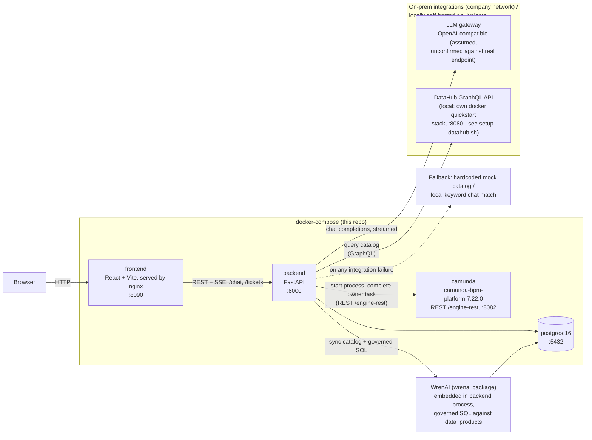
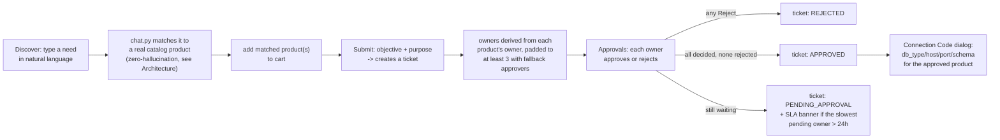
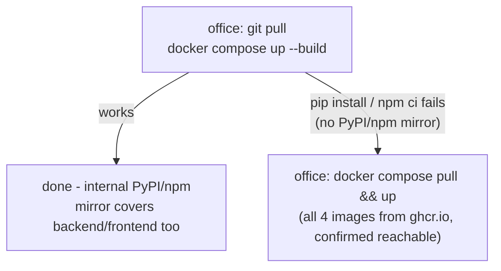

# Intelligent Data Governance — On-Prem

On-prem build of the data governance agent, for the company's air-gapped
internal network. See **`HANDOFF.md` first** — it explains why this is a
separate repo from the GCP PoC, what's swapped (Gemini → on-prem LLM,
Firestore → PostgreSQL, Dataplex → DataHub, Camunda SaaS → self-managed
Camunda), and what business logic / UI direction to carry over.

## 中文說明

這份 README 主要用英文寫，這一節是給不想切語言、想快速掌握全貌的中文摘要——細節（架構圖、逐檔案的 code map、部署步驟）都在下面對應的英文章節，這裡不重複貼一次圖，只講重點。

**這是什麼：** GCP PoC（`data_governance_agent_poc.ai`，另一個 repo）的 on-prem 重建版，因為公司內網是氣隔離（air-gapped）——連得到 GitHub，但連不到 PyPI/npm/Docker Hub——原本 PoC 用的 Gemini/Firestore/Dataplex/Camunda SaaS 全部要換成內網可用的服務。兩個 repo **故意不共用程式碼**，重用的是行為/設計，不是檔案。細節在 `HANDOFF.md`。

**技術堆疊：** 後端 FastAPI + PostgreSQL，前端 React + Vite，Camunda（REST API）跟 DataHub（GraphQL）都是真的串接（不是 mock），串不上時會 graceful fallback（例如查目錄失敗就退回內建的假目錄，LLM 打不通就退回本地關鍵字比對）。另外還內嵌了 WrenAI（`wrenai` pip 套件，**不是**另外一個 service）當語意層——LLM 對照語意模型欄位名組 SQL，WrenAI 的 governed engine 執行並擋掉任何沒宣告過的欄位/資料表，用來取代原本「靠 prompt 指令+事後字串比對」的推薦機制，讓「這句話該推薦哪個資料主體」這件事變成結構性零幻想，而不是只靠 LLM 自己乖。

**重要修正（2026-07-29）：Camunda 公司實際用的是 7.22 版**，不是原本以為的 Camunda 8（Zeebe/gRPC）——是完全不同的產品（REST API，沒有 gRPC/job worker 模型）。`camunda_client.py` 已經整個重寫並拿真實的本機 `camunda/camunda-bpm-platform:7.22.0` container 實測驗證過。

**目前狀態：** 前端已經把 PoC 的 UI 完整 port 過來並跑過完整 Playwright 端到端測試，視覺風格已改成對齊公司 TADiS 設計系統；後端 **88** 個 pytest、前端 29 個 vitest 全過；`ruff`/`mypy`/`oxlint` 全乾淨。LLM 的 OpenAI-compatible 假設已經拿本機 Ollama 實測驗證過可行，但**公司內部真實的 LLM gateway 還沒接過**——這是到公司要做的事，見下面「到公司後怎麼做」。另外還做了一套 DeepEval eval 套件（`backend/evals/`）可以量化評分聊天比對的表現，目前只拿本機 Ollama 測過。**Camunda 跟 DataHub 現在都可以完整本機自架**（`docker-compose.yml` 的 `camunda` service + `scripts/setup-datahub.sh`），整個「建立票單 -> Camunda 啟動流程 -> 簽核 -> Camunda 任務完成」的迴圈已經拿真實跑起來的 app 驗證過，不只是 curl 測試——細節見 `HANDOFF.md`「Camunda + DataHub: local hosting and the external-service switch」。**安全性：** 所有 `/api/*` route 現在支援 `X-API-Key` 驗證（預設關閉，設定 `API_KEY` 就會啟用）；前端曾經有 3 處真的 XSS 漏洞（把 LLM/使用者輸入直接當 HTML 渲染）已修掉——細節見 HANDOFF.md「Security review」。**搜尋：** Discover 頁多了「一般搜尋／AI 搜尋」切換（預設一般搜尋，純關鍵字比對不用 LLM）。**2026-08-04 確認 `ghcr.io` 公司防火牆連得到**——不只 backend/frontend，`camunda`、`postgres` 兩個 image 現在也是走這條路 mirror 過去的（公司內部的 Harbor/Nexus 沒有 Camunda image），細節見下面「Getting an image onto the air-gapped network」跟 `HANDOFF.md`「Getting Camunda + Postgres into the office network」。

**架構：** 四個 container 用 `docker-compose` 跑——`frontend`（nginx 提供 React 靜態檔，:8090）呼叫 `backend`（FastAPI，:8000）的 REST/SSE API，`backend` 再讀寫 `postgres`（:5432，本機自架），也打 `camunda`（本機自架的 REST API，:8082），並對外打兩個內網服務：LLM gateway、DataHub 的 GraphQL API（本機開發時是獨立的 `datahub docker quickstart` stack，:8080）——任何一個打不通都有 fallback，不會直接掛掉。完整圖見下面「Architecture」章節。

**程式碼在哪裡：** 後端邏輯全在 `backend/app/`——`main.py` 是所有 HTTP 路由、票單/簽核狀態機、`X-API-Key` 驗證，`chat.py` 是聊天助理（打招呼快速回覆、zero-hallucination 提示詞、LLM 打不通時的本地關鍵字 fallback、`keyword_search()` 一般搜尋模式），`config.py` 集中管理所有環境變數，`db.py` 是資料庫 model，`integrations/` 底下三個檔案分別對應 LLM/Camunda/DataHub 三個外部串接。前端在 `frontend/src/`——`App.jsx` 管全域狀態，`api.js` 是所有後端呼叫（含手刻的 SSE 串流解析），`i18n.js` 管中英文字串，`components/` 底下一個檔案一個 UI 元件。完整逐檔案說明見下面「Code map」章節。

**怎麼跑起來 / 公司內網部署策略：** 第一次跑之前要先 `cp backend/.env.example backend/.env`（**必須**，`docker-compose.yml` 會直接讀這個檔案，不存在的話連啟動都會失敗）——裡面預設值是假的 LLM/DataHub 端點，先用預設值就能跑起來看 fallback 行為（Camunda 預設就是本機真的跑起來，不是 fallback），之後知道真實內網端點再回來改。接著本機（家裡）直接 `docker compose up --build` 就能跑。公司內網因為連不到 PyPI/npm，第一步應該先直接在公司試同一條指令——如果內網本身有設定 registry mirror 可能就直接通了；如果 `pip install`/`npm ci` 卡住，才需要退回「家裡先 build 好 image，想辦法弄進公司內網」這條路，用已經 build/mirror 好、設成 public 的 GHCR image（`docker compose pull` 不用登入就能拉，`ghcr.io` 公司防火牆已確認連得到）——`backend`/`frontend` 是這個 repo 自己 build 的，`camunda`/`postgres` 是從 Docker Hub mirror 過去的（因為公司的 Harbor 沒有 Camunda image）。完整決策流程、指令、以及怎麼把測試結果（log）帶回家給我看，見下面「Getting an image onto the air-gapped network」跟 `TESTING_LOG.md`。

## 到公司後怎麼做（照順序，一步一步）

這節是給你到公司當場照著做的清單，不用跳來跳去查其他章節。每一步都寫了「怎麼知道這步成功了」。

**Step 0 — 拿程式碼**

兩種方式，差在「之後能不能自動同步」：

- **`git clone`（推薦）**：需要先建一個 GitHub PAT（Settings → Developer settings → Personal access tokens → Tokens (classic)，勾 `repo` 權限就好，read 即可）。這樣才能之後 `git pull` 拿更新，也才能用 `scripts/collect-debug-log.sh` 自動把診斷結果 commit + push 回來給我看。
  ```bash
  git clone https://github.com/mail2yee/intelligent-data-governance-agent-onprem.git
  cd intelligent-data-governance-agent-onprem
  ```
- **GitHub 網頁「Download ZIP」解壓縮**：不用設定 git 帳密，簡單，但拿到的資料夾沒有 `.git`——之後沒辦法 `git pull`、也沒辦法自動 push 診斷結果，要手動複製貼上回來給我。

**Step 1 — 建立設定檔（必須，否則連啟動都會失敗）**
```bash
cp backend/.env.example backend/.env
```
先不改內容也能跑（會用假的 LLM/DataHub 端點，你會看到 fallback 行為，例如搜尋會退回本地關鍵字比對；Camunda 不算在這裡面，它預設就是本機真的跑起來，不是 fallback）——這是正常的，不是壞掉，Step 5 再回來接公司真實的 LLM。

**Step 2 — 第一次嘗試：直接在公司 build**
```bash
docker compose up --build
```
`camunda`、`postgres` 這兩個 image 現在已經是從 `ghcr.io` 拉（2026-08-04 確認公司防火牆連得到，不再依賴公司的 Harbor/Nexus，那邊本來就沒有 Camunda image），所以這行真正還不確定的，只剩 `backend`/`frontend` 自己 build 的部分：base image（`python:3.11-slim`/`node:20-alpine` 等）拉不拉得到、`pip install` 走不走得到 PyPI mirror、`npm ci` 走不走得到 npm mirror。**如果這行成功，直接跳到 Step 4**，不用管 Step 3。

**Step 3 — 如果 Step 2 失敗（`pip install`/`npm ci` 卡住）：全部改拉已經 build/mirror 好的 image**
```bash
docker compose pull
docker compose up -d
```
四個 image（`backend`/`frontend` 是這個 repo 自己 build 的，`camunda`/`postgres` 是從 Docker Hub mirror 過去的）都已經 push 到 `ghcr.io` 並設成 public，不用登入就能拉，公司防火牆連不連得到 `ghcr.io` 這件事本身已經確認過沒問題（2026-08-04）。這步理論上應該會成功——如果還是失敗，代表公司網路狀況跟上次測的時候不一樣了，值得先確認這點，而不是照舊假設。

如果 Step 3 也失敗：先不要繼續往下試，跳到最下面「有問題怎麼辦」那段，把診斷結果帶回來，我們再一起想下一步。

**Step 4 — 確認真的跑起來了**
```bash
curl http://localhost:8000/health   # 應該回傳 {"status":"ok"}
```
瀏覽器打開 http://localhost:8090 應該看到「智慧資料治理平台」畫面，可以試著搜尋一句話看看（現在還沒接公司 LLM，會走 fallback，屬於正常現象）。

**Step 5 — 接上公司真實的 LLM（如果你已經知道公司內部 gateway 的網址/model 名稱）**

編輯 `backend/.env`，把這三行改成公司真實的值：
```bash
LLM_BASE_URL=<公司內部 LLM gateway 網址>/v1
LLM_MODEL=<公司內部的 model 名稱>
LLM_API_KEY=<如果 gateway 需要驗證的話，不需要就留空>
```
改完套用（不用重新 build，只要讓 container 重新讀取 `.env`）：
```bash
docker compose up -d --force-recreate backend
```
再回 Step 4 測一次搜尋，這次應該會真的呼叫公司的 LLM，不再是 fallback（可以從瀏覽器的「顯示思考過程」或 `docker compose logs backend` 觀察差異）。

**Step 6（選用）— 跑 eval，看公司 model 表現怎麼樣**
```bash
pip install -r backend/requirements-eval.txt
DGO_EVAL_JUDGE_MODEL=<公司 model 名稱> \
DGO_EVAL_JUDGE_BASE_URL=<公司 gateway 網址>/v1 \
DGO_EVAL_JUDGE_API_KEY=<如果需要> \
pytest backend/evals/ -v -s
```
結果值得記錄的話，寫進 `backend/evals/EVAL_LOG.md`（跟本機用 Ollama 測出來的 0.50-1.00 分數對照，看真實的公司 model 表現如何）。細節見 `backend/README.md`「Evals」那節。

**有問題怎麼辦：**
```bash
./scripts/collect-debug-log.sh
```
自動收集 git 狀態、docker/compose 版本、對 `github.com`/`ghcr.io`/Docker Hub/PyPI/npm 的連線測試、`docker compose config`/`pull`/`ps`/`logs`，做基本的密碼/token 遮蔽後印出來給你看，確認沒問題再問你要不要 commit + push（只有 Step 0 用 `git clone` 才能這樣自動回傳；用 ZIP 的話這個檔案還是會產生，只是最後要手動複製貼上內容給我，不是自動 push）。

## Status: full PoC UI ported, verified end-to-end

- Backend (FastAPI + PostgreSQL) tested end-to-end against a real
  Postgres: catalog fetch, SSE chat streaming (greeting fast-path,
  zero-hallucination guard, local-keyword fallback when the LLM endpoint
  isn't reachable instead of just erroring out), ticket create/list, and
  the full approve/reject state machine (including SLA cycle-time
  tracking).
- Frontend (React + Vite) is a full port of the GCP PoC's UI: Discover
  search with live SSE streaming (reasoning steps + answer text appear
  as they happen, not after one big wait), Approvals list with SLA
  highlighting, cart + submit dialog, connection-code dialog, Copilot
  dock, zh/en toggle, light/dark toggle (light by default regardless of
  OS preference), collapsible nav rail. Verified via a full Playwright
  run through every flow against the real backend — zero console errors.
- **Camunda 7.22 (REST API — corrected 2026-07-29 from an earlier, wrong
  Camunda 8/Zeebe assumption) and DataHub (GraphQL) integrations are
  real, wired clients**, and both can now be **fully self-hosted
  locally**: `docker-compose.yml`'s `camunda` service (auto-deploys
  `camunda/data-gov-approval.bpmn` on startup) and
  `scripts/setup-datahub.sh` (its own `datahub docker quickstart` stack +
  sample dataset seeding). The complete loop — create a ticket -> Camunda
  starts a process instance -> an owner approves in-app -> that owner's
  Camunda task completes -> ticket reaches APPROVED and the Camunda
  process instance ends — is verified end-to-end through the actual
  running app, not just curl against a standalone container. See
  HANDOFF.md "Camunda + DataHub: local hosting and the external-service
  switch" for the full writeup, including the config switch to point
  either one at the company's real external service instead
  (`CAMUNDA_BASE_URL`/`DATAHUB_API_URL`, no code change needed) and gaps
  still explicitly deferred (approval-endpoint auth, email
  notifications, ticket deep-linking).
- LLM integration assumes an OpenAI-compatible endpoint — **confirmed
  working against a real local Ollama** (2026-07-28), but still
  **unconfirmed against the company's actual on-prem gateway** (a
  different, untested endpoint), see
  `backend/app/integrations/llm_client.py`.
- WrenAI, embedded as a Python library (not a separate service - see
  HANDOFF.md), enforces zero-hallucination product matching for
  `chat.py`; a DeepEval-based eval suite (`backend/evals/`) can score
  reply quality/precision against any OpenAI-compatible judge model,
  local or the company's real gateway — see "Evals" in
  `backend/README.md`.
- **Security review (2026-07-30)**: found and fixed zero authentication
  on the API (every `/api/*` route now supports `X-API-Key`, off by
  default) and 3 real frontend XSS sites (`dangerouslySetInnerHTML` on
  LLM/user-controlled text, now plain text). Interim measures, not a
  full fix — see HANDOFF.md "Security review" for what's still open
  (notably `submit_approval()`'s owner-impersonation gap, which needs
  real SSO/OIDC).
- **Discover search has a general/AI mode toggle** (2026-07-31, defaults
  to general/keyword search — plain `ILIKE` match against the catalog,
  no LLM call). Greeting detection (`is_greeting()`) is keyword-only —
  an LLM-based fallback was tried and reverted after live testing showed
  it unreliable on a small local model; unmatched queries are logged
  instead for offline, human-reviewed triage
  (`backend/scripts/review_unmatched_queries.py`) — see HANDOFF.md.
- **`camunda`/`postgres` now mirror from GHCR** (2026-08-04), same as
  `backend`/`frontend` — confirmed the office network can reach
  `ghcr.io` even though it can't reach Docker Hub or the company's own
  Harbor/Nexus (neither has a Camunda image). See "Getting an image onto
  the air-gapped network" below.

## Architecture



Ticket/approval state machine and chat contract are documented in
`HANDOFF.md` ("Business logic and data model to preserve") — this
diagram is just the component/network shape, not the business logic.

## Product flow

What a user actually does, end to end - full business rules (owner
padding, SLA threshold, exact status-derivation logic) are in
`HANDOFF.md` "Business logic and data model to preserve"; this is the
shape of the flow, not every rule.



- **Discover** (`DiscoverView.jsx` / `chat.py`): a natural-language need
  gets matched to catalog product(s) via the semantic layer, streamed
  live as `step`/`token` SSE events, cards render once a `final` event
  arrives with the verified `matched_products`.
- **Cart → Submit** (`CartBar.jsx`, `SubmitDialog.jsx` /
  `POST /api/tickets`): selected products + an objective/purpose become
  a ticket. Owners are the union of each product's real owner, padded to
  a minimum of 3 with `DEFAULT_FALLBACK_APPROVERS` if short - this
  padding rule is arbitrary PoC filler, ported as-is, worth reconsidering
  once real approval requirements are known (see HANDOFF.md). Camunda is
  notified best-effort (`camunda_client.py`) - a "Skipped" status if
  unreachable doesn't block ticket creation; if it succeeds, the returned
  `process_instance_id` is persisted on the ticket for later use.
- **Approvals** (`ApprovalsView.jsx`/`TicketRow.jsx` /
  `POST /api/tickets/{id}/approvals`): each owner approves or rejects
  independently; ticket status is derived, not stored as an independent
  field - `REJECTED` wins if any owner rejects, `APPROVED` only once
  every owner has decided and none rejected, otherwise
  `PENDING_APPROVAL`. The SLA banner looks at whichever pending owner has
  waited longest since their approval record was created; past 24h it
  surfaces a warning on that ticket's expanded row. Also completes that
  owner's task in Camunda (best-effort, via the persisted
  `process_instance_id`) - verified end-to-end that the process instance
  itself ends once every owner's task is completed this way.
- **Connection Code** (`ConnectionCodeDialog.jsx` /
  `GET /api/catalog/{id}/connection`): once approved, this is as far as
  the app goes - it hands back the target database's connection details
  (`db_type`/`db_host`/`db_port`/`db_schema`) for the user to connect
  with their own tools. The app never queries the real underlying
  business data itself (see HANDOFF.md's semantic-layer scope notes).

### Getting an image onto the air-gapped network

The open question is *how the backend/frontend images get built* when
the company network can reach GitHub but not PyPI/npm/Docker Hub
directly (see `HANDOFF.md` "Why this repo exists" for the full
constraint). `camunda`/`postgres` are a solved problem now (both mirror
from GHCR, confirmed reachable from the office - see below); the open
part is specifically whether `backend`/`frontend` can `pip install`/
`npm ci` on-site. Try these **in order** — each one only matters if the
previous one fails:



**Step 1 — just try it at the office first, before anything else:**
```bash
git pull
docker compose up --build
```
`camunda`/`postgres` will pull from `ghcr.io` regardless (already
confirmed working from the office - see below), so this command really
only tests whether `backend`/`frontend` can build on-site: whether the
Docker daemon's registry mirror covers the base images
(`python:3.11-slim`, `node:20-alpine`, `nginx:alpine` — many corporate
Docker setups configure a transparent `registry-mirrors` entry in
`daemon.json` for this, no Dockerfile change needed), whether `pip
install` reaches an internal PyPI mirror, and whether `npm ci` reaches
an internal npm mirror. If this works, nothing else in this section is
needed.

**Step 2 — if `pip`/`npm` can't reach a mirror,** the image has to be
built somewhere with internet access (i.e. at home) and gotten onto the
company network some other way.

- **Internal registries (Harbor, Nexus)**: confirmed 2026-08-04 these
  exist but don't mirror everything - no Camunda image there, for one.
  Still worth checking first for anything they *do* have (see below).
- **GHCR path (`ghcr.io`) — confirmed working end-to-end, including from
  the office (2026-08-04):** `docker-compose.yml`'s `backend`/`frontend`
  services set `image:` to
  `ghcr.io/mail2yee/intelligent-data-governance-agent-onprem-{backend,frontend}:latest`
  alongside `build:` (`docker compose build` at home tags it, `docker
  compose push` publishes it). **`camunda` and `postgres` use the same
  path now too** (`ghcr.io/mail2yee/camunda-bpm-platform:7.22.0`,
  `ghcr.io/mail2yee/postgres:16-alpine`) - since neither is built by this
  repo, `scripts/mirror-image-to-ghcr.sh` does the pull-retag-push for
  those instead of `docker compose build`. All four images are flipped
  to **public** — confirmed by logging out locally and pulling
  anonymously (no `docker login` at all) successfully. So the office
  side really can just be `git pull && docker compose pull && docker
  compose up -d`, no PAT needed there.
  **`ghcr.io` reachability from the office is now confirmed** (2026-08-04
  - it's a different host than `github.com`, which was already known to
  work, so this needed its own test). Revisit switching the packages
  back to private once this moves past the testing phase.

Either way, capture what happens at the office with
`./scripts/collect-debug-log.sh` (or manually in `TESTING_LOG.md`) and
push it — see that file for details. It checks reachability to
`github.com`/`ghcr.io`/Docker Hub/PyPI/npm in one shot, which tells you
which of the steps above is worth trying.

## Code map

Where things live and what each piece is for — HANDOFF.md has the *why*
(business rules, UI direction, what's confirmed vs. assumed), this is
just the *where*.

**Backend** (`backend/app/`):
- `main.py` — FastAPI app, every HTTP route: `/health` (unauthenticated),
  `/api/catalog`, `/api/catalog/{id}/connection`, `/api/chat` (SSE),
  `/api/tickets` (create/list), `/api/tickets/{id}/approvals`
  (approve/reject) — all `/api/*` routes require `X-API-Key` when
  `API_KEY` is set (`require_api_key`). Owns the ticket/approval state
  machine — status derivation and cycle-time calculation live right in
  the route handlers, no separate service layer.
- `chat.py` — the chat/search assistant: greeting fast-path
  (`is_greeting`), the zero-hallucination prompt (`build_prompt`), the
  local keyword fallback (`local_rule_match`) used only when the LLM is
  unreachable, `keyword_search()` (the default "general search" mode -
  plain multi-keyword AND `ILIKE` against `data_products.search_text`,
  no LLM involved - see HANDOFF.md), and `run_chat(..., mode="ai" |
  "keyword")`, the async generator that yields the SSE `step` / `token`
  / `final` events.
- `config.py` — one `pydantic-settings` field per `.env` variable (LLM /
  Camunda / DataHub endpoints, CORS origins, fallback approvers). Any new
  env-tunable value belongs here, not scattered as a literal elsewhere.
- `db.py` — SQLAlchemy async models (`Ticket`, `Approval`) plus the
  engine/session factory. Schema is created on startup via `init_db()` —
  no migrations tool yet, fine for this stage.
- `integrations/llm_client.py` — calls the on-prem LLM gateway, assumed
  OpenAI-compatible (`POST {LLM_BASE_URL}/chat/completions`,
  `stream: true`) — **unconfirmed** against the real endpoint.
- `integrations/camunda_client.py` — Camunda 7 REST client
  (`/engine-rest`): starts a BPMN process instance per new ticket
  (`start_approval_process`) and completes an individual owner's task on
  approval (`complete_approval_task`); both return a "Skipped" status
  gracefully if Camunda isn't reachable, never raise. See
  `camunda/data-gov-approval.bpmn` for the deployed process (a
  multi-instance user task, one per owner).
- `integrations/datahub_client.py` — queries DataHub's GraphQL API for
  the product catalog (mapping `customProperties` to the fields the
  frontend expects); falls back to a hardcoded 3-item mock catalog if
  DataHub is unreachable or empty. See `datahub/seed_catalog.py` /
  `scripts/setup-datahub.sh` for seeding a local instance with sample
  data matching this shape.
- `integrations/wrenai_client.py` — WrenAI semantic layer, embedded as a
  Python library (not a service, see HANDOFF.md for why that matters).
  Mirrors the DataHub catalog into a `data_products` table
  (`sync_catalog()`) and executes agent-written SQL against it through a
  governed engine (`resolve_matches()`) that structurally can't return a
  row outside the declared semantic model (`../wren/project/`) - this is
  what `chat.py`'s `resolve_via_semantic_layer()` uses for
  zero-hallucination data-subject matching.
- `tests/` — the pytest suite (88 tests), one file per module above.

**Frontend** (`frontend/src/`):
- `App.jsx` — top-level state (lang, theme, current view, cart, tickets)
  and wiring between the two views and the dialogs/dock. No router —
  `view` (`'discover'` / `'approvals'`) is just local state.
- `api.js` — every backend call lives here, including `streamChat()`,
  which parses the `/api/chat` SSE stream by hand (buffers partial
  frames, splits on blank lines) rather than using an SSE library.
- `i18n.js` — `makeT(lang)` returns a `t(key)` translator; a test checks
  zh/en key parity so the two languages can't silently drift apart.
- `components/DiscoverView.jsx` — search hero, result cards, the live
  "reasoning steps" disclosure, and the general/AI search mode toggle
  (persisted in `localStorage`, defaults to general/keyword search - see
  HANDOFF.md).
- `components/ApprovalsView.jsx` + `TicketRow.jsx` — expandable ticket
  rows, approve/reject actions, the SLA warning banner.
- `components/CopilotDock.jsx` — the docked "小幫手" assistant panel,
  drives `streamChat()`.
- `components/NavRail.jsx`, `TopBar.jsx` — chrome: collapsible nav
  groups, lang/theme toggles.
- `components/CartBar.jsx`, `SubmitDialog.jsx`,
  `ConnectionCodeDialog.jsx`, `Toast.jsx`, `ThinkingDots.jsx` —
  supporting UI pieces, one component per file.
- `*.test.jsx` / `*.test.js` — vitest + React Testing Library (29 tests).

## Run it locally (dev, at home)

**Configuration (required once, before the first run):**
```bash
cp backend/.env.example backend/.env   # required - docker-compose.yml
                                        # references this file directly; it
                                        # won't even start without it existing
cp .env.example .env                   # optional - only needed to override
                                        # the default Postgres password
```
`backend/.env`'s defaults (mock LLM endpoint) are enough to start the app
and see it fall back gracefully — edit `LLM_BASE_URL`/`LLM_MODEL`/
`LLM_API_KEY` once the real on-prem gateway is known. See the comments in
`backend/.env.example` for what each variable does.

**Auth note:** every `/api/*` route is unauthenticated by default (`API_KEY`
blank) — fine for local dev, but set `API_KEY` in `backend/.env` **and**
matching `VITE_API_KEY` in the repo-root `.env` (rebuild the frontend image
after changing it — Vite bakes it in at build time, see
`frontend/Dockerfile`) before any real deployment. See HANDOFF.md's
"Security review" section for exactly what this does and doesn't protect
against.

```bash
docker compose up --build
```

This alone gives you Postgres + a self-hosted Camunda 7.22 (the
`camunda` service auto-deploys `camunda/data-gov-approval.bpmn`) + the
backend/frontend — the full ticket/approval/Camunda-task-completion loop
works with zero extra setup. DataHub is optional and self-hosted
separately (its own `datahub docker quickstart` stack, not part of this
compose file — see `scripts/setup-datahub.sh`); without it, the app falls
back to its built-in 3-item mock catalog automatically.

- Frontend: http://localhost:8090
- Backend: http://localhost:8000 (docs at `/docs`)
- Postgres: localhost:5432 (user/pass/db: `dgo`/`dgo`/`dgo`)
- Camunda: http://localhost:8082/engine-rest (REST API, no UI)
- DataHub (if `scripts/setup-datahub.sh` has been run): GMS
  http://localhost:8080, UI http://localhost:9002
  (user/pass: `datahub`/`datahub`)

Or run backend/frontend separately without Docker — see
`backend/README.md` and `frontend/README.md` (same `backend/.env` config
step applies there too).

## Repo layout

```
backend/                    FastAPI API (Python) — see backend/README.md
frontend/                   React + Vite SPA — see frontend/README.md
wren/project/                WrenAI semantic model (MDL) - see app/integrations/wrenai_client.py
camunda/data-gov-approval.bpmn  BPMN process this app deploys to Camunda itself on startup
datahub/seed_catalog.py     seeds sample dataset entities into a local DataHub instance
scripts/setup-datahub.sh    stands up + seeds a local DataHub instance (own docker quickstart stack)
scripts/mirror-image-to-ghcr.sh  retags + pushes a public third-party image (Camunda, Postgres) to this repo's GHCR namespace
backend/scripts/review_unmatched_queries.py  offline, human-reviewed triage of chat queries that matched nothing
k8s/                        placeholder for future Kubernetes manifests (not needed yet — Docker is fine for now)
scripts/collect-debug-log.sh  one-command diagnostics collector, see TESTING_LOG.md
debug-logs/                 output of the script above, committed for review from home
docker-compose.yml          local/on-prem multi-container dev setup (postgres, camunda, backend, frontend)
TESTING_LOG.md               office <-> home handoff log (no Claude Code on-site)
HANDOFF.md                  why this repo exists, what to port from the GCP PoC, current constraints
```
