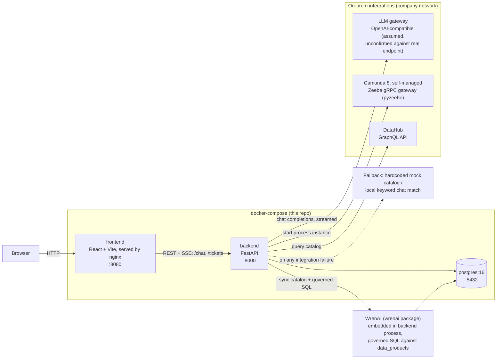
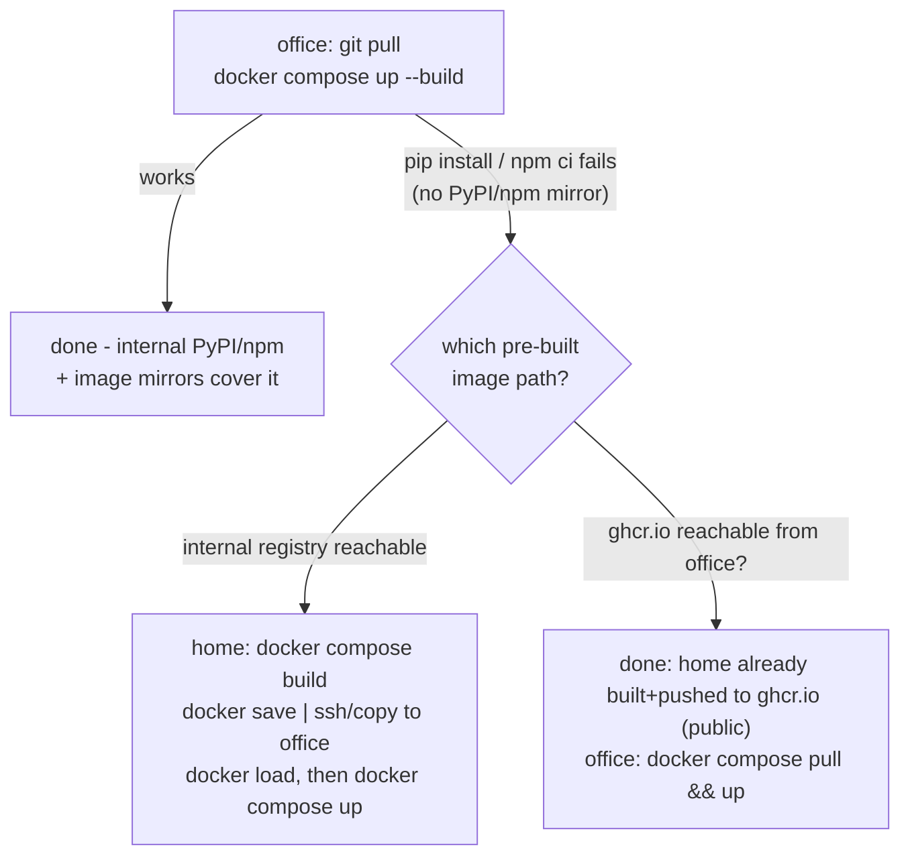

# Intelligent Data Governance — On-Prem

On-prem build of the data governance agent, for the company's air-gapped
internal network. See **`HANDOFF.md` first** — it explains why this is a
separate repo from the GCP PoC, what's swapped (Gemini → on-prem LLM,
Firestore → PostgreSQL, Dataplex → DataHub, Camunda SaaS → self-managed
Camunda), and what business logic / UI direction to carry over.

## 中文說明

這份 README 主要用英文寫，這一節是給不想切語言、想快速掌握全貌的中文摘要——細節（架構圖、逐檔案的 code map、部署步驟）都在下面對應的英文章節，這裡不重複貼一次圖，只講重點。

**這是什麼：** GCP PoC（`data_governance_agent_poc.ai`，另一個 repo）的 on-prem 重建版，因為公司內網是氣隔離（air-gapped）——連得到 GitHub，但連不到 PyPI/npm/Docker Hub——原本 PoC 用的 Gemini/Firestore/Dataplex/Camunda SaaS 全部要換成內網可用的服務。兩個 repo **故意不共用程式碼**，重用的是行為/設計，不是檔案。細節在 `HANDOFF.md`。

**技術堆疊：** 後端 FastAPI + PostgreSQL，前端 React + Vite，Camunda（用 `pyzeebe`/gRPC）跟 DataHub（GraphQL）都是真的串接（不是 mock），串不上時會 graceful fallback（例如查目錄失敗就退回內建的假目錄，LLM 打不通就退回本地關鍵字比對）。另外還內嵌了 WrenAI（`wrenai` pip 套件，**不是**另外一個 service）當語意層——LLM 對照語意模型欄位名組 SQL，WrenAI 的 governed engine 執行並擋掉任何沒宣告過的欄位/資料表，用來取代原本「靠 prompt 指令+事後字串比對」的推薦機制，讓「這句話該推薦哪個資料主體」這件事變成結構性零幻想，而不是只靠 LLM 自己乖。

**目前狀態：** 前端已經把 PoC 的 UI 完整 port 過來並跑過完整 Playwright 端到端測試；後端 36 個 pytest、前端 29 個 vitest 全過；`ruff`/`mypy`/`oxlint` 全乾淨。還沒確認的三件事：LLM gateway 是不是真的走 OpenAI-compatible 格式、Camunda 的 BPMN process 還沒部署、DataHub 的欄位對應（`customProperties`）還沒對到真實 instance 驗證過。

**架構：** 三個 container 用 `docker-compose` 跑——`frontend`（nginx 提供 React 靜態檔，:8080）呼叫 `backend`（FastAPI，:8000）的 REST/SSE API，`backend` 再讀寫 `postgres`（:5432），並對外打三個內網服務：LLM gateway、Camunda 的 Zeebe gRPC gateway、DataHub 的 GraphQL API——任何一個打不通都有 fallback，不會直接掛掉。完整圖見下面「Architecture」章節。

**程式碼在哪裡：** 後端邏輯全在 `backend/app/`——`main.py` 是所有 HTTP 路由和票單/簽核狀態機，`chat.py` 是聊天助理（打招呼快速回覆、zero-hallucination 提示詞、LLM 打不通時的本地關鍵字 fallback），`config.py` 集中管理所有環境變數，`db.py` 是資料庫 model，`integrations/` 底下三個檔案分別對應 LLM/Camunda/DataHub 三個外部串接。前端在 `frontend/src/`——`App.jsx` 管全域狀態，`api.js` 是所有後端呼叫（含手刻的 SSE 串流解析），`i18n.js` 管中英文字串，`components/` 底下一個檔案一個 UI 元件。完整逐檔案說明見下面「Code map」章節。

**怎麼跑起來 / 公司內網部署策略：** 第一次跑之前要先 `cp backend/.env.example backend/.env`（**必須**，`docker-compose.yml` 會直接讀這個檔案，不存在的話連啟動都會失敗）——裡面預設值是假的 LLM/Camunda/DataHub 端點，先用預設值就能跑起來看 fallback 行為，之後知道真實內網端點再回來改。接著本機（家裡）直接 `docker compose up --build` 就能跑。公司內網因為連不到 PyPI/npm，第一步應該先直接在公司試同一條指令——如果內網本身有設定 registry mirror 可能就直接通了；如果 `pip install`/`npm ci` 卡住，才需要退回「家裡先 build 好 image，想辦法弄進公司內網」這條路——內部 registry，或是已經 build+push 好、設成 public 的 GHCR image（`docker compose pull` 不用登入就能拉，只差公司防火牆連不連得到 `ghcr.io` 這個網域還沒實測）。完整決策流程、指令、以及怎麼把測試結果（log）帶回家給我看，見下面「Getting an image onto the air-gapped network」跟 `TESTING_LOG.md`。

## 到公司後怎麼做（照順序，一步一步）

這節是給你到公司當場照著做的清單，不用跳來跳去查其他章節。每一步都寫了「怎麼知道這步成功了」。

**Step 0 — 拿程式碼**

兩種方式，差在「之後能不能自動同步」：

- **`git clone`（推薦）**：需要先建一個 GitHub PAT（Settings → Developer settings → Personal access tokens → Tokens (classic)，勾 `repo` 權限就好，read 即可）。這樣才能之後 `git pull` 拿更新，也才能用 `scripts/collect-debug-log.sh` 自動把診斷結果 commit + push 回來給我看。
  ```bash
  git clone https://github.com/mail2yee/intelligent-data-governance-agent-onprem.git
  cd intelligent-data-governance-agent-onprem
  ```
- **GitHub 網頁「Download ZIP」解壓縮**：不用設定 git 帳密，簡單，但拿到的資料夾沒有 `.git`——之後沒辦法 `git pull`、也沒辦法自動 push 診斷結果，要手動複製貼上回來給我。

**Step 1 — 建立設定檔（必須，否則連啟動都會失敗）**
```bash
cp backend/.env.example backend/.env
```
先不改內容也能跑（會用假的 LLM/Camunda/DataHub 端點，你會看到 fallback 行為，例如搜尋會退回本地關鍵字比對）——這是正常的，不是壞掉，Step 5 再回來接公司真實的 LLM。

**Step 2 — 第一次嘗試：直接在公司 build**
```bash
docker compose up --build
```
這行同時測試三件事：base image（`python:3.11-slim`/`node:20-alpine` 等）拉不拉得到、`pip install` 走不走得到 PyPI mirror、`npm ci` 走不走得到 npm mirror。**如果這行成功，直接跳到 Step 4**，不用管 Step 3。

**Step 3 — 如果 Step 2 失敗（`pip install`/`npm ci` 卡住）：改拉已經 build 好的 image**
```bash
docker compose pull
docker compose up -d
```
`backend`/`frontend` 這兩個 image 已經 build 好、push 到 `ghcr.io` 並設成 public（2026-07-28 已驗證，不用登入就能拉）——**這步真正在測的是公司防火牆連不連得到 `ghcr.io` 這個網域**（`github.com` 已知連得到，但 `ghcr.io` 是不同網域，沒實測過）。`postgres` 那個 image 走 Docker Hub，理論上公司內部的 Docker image mirror 會處理（HANDOFF.md 有記錄這個 mirror 存在），如果連這行都失敗，代表這個假設也要重新確認。

如果 Step 3 也失敗：先不要繼續往下試，跳到最下面「有問題怎麼辦」那段，把診斷結果帶回來，我們再一起想下一步（可能是內部 registry、或者我在家 `docker save`/`docker load` 傳檔案過去）。

**Step 4 — 確認真的跑起來了**
```bash
curl http://localhost:8000/health   # 應該回傳 {"status":"ok"}
```
瀏覽器打開 http://localhost:8080 應該看到「智慧資料治理平台」畫面，可以試著搜尋一句話看看（現在還沒接公司 LLM，會走 fallback，屬於正常現象）。

**Step 5 — 接上公司真實的 LLM（如果你已經知道公司內部 gateway 的網址/model 名稱）**

編輯 `backend/.env`，把這三行改成公司真實的值：
```bash
LLM_BASE_URL=<公司內部 LLM gateway 網址>/v1
LLM_MODEL=<公司內部的 model 名稱>
LLM_API_KEY=<如果 gateway 需要驗證的話，不需要就留空>
```
改完套用（不用重新 build，只要讓 container 重新讀取 `.env`）：
```bash
docker compose up -d --force-recreate backend
```
再回 Step 4 測一次搜尋，這次應該會真的呼叫公司的 LLM，不再是 fallback（可以從瀏覽器的「顯示思考過程」或 `docker compose logs backend` 觀察差異）。

**Step 6（選用）— 跑 eval，看公司 model 表現怎麼樣**
```bash
pip install -r backend/requirements-eval.txt
DGO_EVAL_JUDGE_MODEL=<公司 model 名稱> \
DGO_EVAL_JUDGE_BASE_URL=<公司 gateway 網址>/v1 \
DGO_EVAL_JUDGE_API_KEY=<如果需要> \
pytest backend/evals/ -v -s
```
結果值得記錄的話，寫進 `backend/evals/EVAL_LOG.md`（跟本機用 Ollama 測出來的 0.50-1.00 分數對照，看真實的公司 model 表現如何）。細節見 `backend/README.md`「Evals」那節。

**有問題怎麼辦：**
```bash
./scripts/collect-debug-log.sh
```
自動收集 git 狀態、docker/compose 版本、對 `github.com`/`ghcr.io`/Docker Hub/PyPI/npm 的連線測試、`docker compose config`/`pull`/`ps`/`logs`，做基本的密碼/token 遮蔽後印出來給你看，確認沒問題再問你要不要 commit + push（只有 Step 0 用 `git clone` 才能這樣自動回傳；用 ZIP 的話這個檔案還是會產生，只是最後要手動複製貼上內容給我，不是自動 push）。

## Status: full PoC UI ported, verified end-to-end

- Backend (FastAPI + PostgreSQL) tested end-to-end against a real
  Postgres: catalog fetch, SSE chat streaming (greeting fast-path,
  zero-hallucination guard, local-keyword fallback when the LLM endpoint
  isn't reachable instead of just erroring out), ticket create/list, and
  the full approve/reject state machine (including SLA cycle-time
  tracking).
- Frontend (React + Vite) is a full port of the GCP PoC's UI: Discover
  search with live SSE streaming (reasoning steps + answer text appear
  as they happen, not after one big wait), Approvals list with SLA
  highlighting, cart + submit dialog, connection-code dialog, Copilot
  dock, zh/en toggle, light/dark toggle (light by default regardless of
  OS preference), collapsible nav rail. Verified via a full Playwright
  run through every flow against the real backend — zero console errors.
- Camunda (`pyzeebe`) and DataHub (GraphQL) integrations are **real,
  wired clients** now, not mocks — verified to correctly attempt a
  connection and fail gracefully when nothing's listening yet. Still
  need: a deployed BPMN process (`CAMUNDA_PROCESS_ID` is a placeholder),
  and validation of the DataHub field-mapping assumptions once there's a
  real instance to test against. See HANDOFF.md "What's actually in this
  repo right now" for the full list of what's confirmed vs. assumed.
- LLM integration assumes an OpenAI-compatible endpoint — **unconfirmed**
  against the real on-prem gateway, see `backend/app/integrations/llm_client.py`.

## Architecture



Ticket/approval state machine and chat contract are documented in
`HANDOFF.md` ("Business logic and data model to preserve") — this
diagram is just the component/network shape, not the business logic.

### Getting an image onto the air-gapped network

The open question is *how the backend/frontend images get built* when
the company network can reach GitHub but not PyPI/npm/Docker Hub
directly (see `HANDOFF.md` "Why this repo exists" for the full
constraint). Try these **in order** — each one only matters if the
previous one fails:



**Step 1 — just try it at the office first, before anything else:**
```bash
git pull
docker compose up --build
```
This single command tests three things at once: whether the Docker
daemon's registry mirror covers the base images (`python:3.11-slim`,
`node:20-alpine`, `nginx:alpine`, `postgres:16-alpine` — many corporate
Docker setups configure a transparent `registry-mirrors` entry in
`daemon.json` for this, no Dockerfile change needed), whether `pip
install` reaches an internal PyPI mirror, and whether `npm ci` reaches
an internal npm mirror. If this works, nothing else in this section is
needed.

**Step 2 — if `pip`/`npm` can't reach a mirror,** the image has to be
built somewhere with internet access (i.e. at home) and gotten onto the
company network some other way. Two options, both untested so far:

- **Internal Docker registry** (the confirmed-to-exist one): build at
  home, push there directly if reachable from home, or `docker save`
  the image to a tarball and carry/copy it over if not, then `docker
  load` on the office side.
- **GHCR path (`ghcr.io`) — publish side done and confirmed working
  (2026-07-28):** `docker-compose.yml`'s `backend`/`frontend` services
  set `image:` to `ghcr.io/mail2yee/intelligent-data-governance-agent-onprem-{backend,frontend}:latest`
  alongside `build:`. Both images have actually been built and pushed
  (`docker login ghcr.io -u mail2yee` with a `write:packages` PAT, then
  `docker compose push`), and both packages are flipped to **public** —
  confirmed by logging out locally and pulling both anonymously (no
  `docker login` at all) successfully. So the office side really can
  just be `git pull && docker compose pull && docker compose up -d`,
  no PAT needed there.
  **Still unconfirmed: whether `ghcr.io` itself (a different host than
  `github.com`) is actually reachable through the office firewall** —
  today's test only confirmed the publish side and that an arbitrary
  internet connection can pull anonymously, not that the specific office
  network can reach this specific host. That's what still needs testing
  on-site. Revisit switching the packages back to private once that's
  confirmed and this moves past the testing phase.

Either way, capture what happens at the office with
`./scripts/collect-debug-log.sh` (or manually in `TESTING_LOG.md`) and
push it — see that file for details. It checks reachability to
`github.com`/`ghcr.io`/Docker Hub/PyPI/npm in one shot, which tells you
which of the steps above is worth trying.

## Code map

Where things live and what each piece is for — HANDOFF.md has the *why*
(business rules, UI direction, what's confirmed vs. assumed), this is
just the *where*.

**Backend** (`backend/app/`):
- `main.py` — FastAPI app, every HTTP route: `/health`, `/api/catalog`,
  `/api/catalog/{id}/connection`, `/api/chat` (SSE), `/api/tickets`
  (create/list), `/api/tickets/{id}/approvals` (approve/reject). Owns the
  ticket/approval state machine — status derivation and cycle-time
  calculation live right in the route handlers, no separate service
  layer.
- `chat.py` — the chat/search assistant: greeting fast-path
  (`is_greeting`), the zero-hallucination prompt (`build_prompt`), the
  local keyword fallback (`local_rule_match`) used only when the LLM is
  unreachable, and `run_chat()`, the async generator that yields the SSE
  `step` / `token` / `final` events.
- `config.py` — one `pydantic-settings` field per `.env` variable (LLM /
  Camunda / DataHub endpoints, CORS origins, fallback approvers). Any new
  env-tunable value belongs here, not scattered as a literal elsewhere.
- `db.py` — SQLAlchemy async models (`Ticket`, `Approval`) plus the
  engine/session factory. Schema is created on startup via `init_db()` —
  no migrations tool yet, fine for this stage.
- `integrations/llm_client.py` — calls the on-prem LLM gateway, assumed
  OpenAI-compatible (`POST {LLM_BASE_URL}/chat/completions`,
  `stream: true`) — **unconfirmed** against the real endpoint.
- `integrations/camunda_client.py` — `pyzeebe` client, starts a BPMN
  process instance per new ticket; returns a "Skipped" status gracefully
  if the gateway/process isn't reachable/deployed yet.
- `integrations/datahub_client.py` — queries DataHub's GraphQL API for
  the product catalog (mapping `customProperties` to the fields the
  frontend expects); falls back to a hardcoded 3-item mock catalog if
  DataHub is unreachable or empty.
- `integrations/wrenai_client.py` — WrenAI semantic layer, embedded as a
  Python library (not a service, see HANDOFF.md for why that matters).
  Mirrors the DataHub catalog into a `data_products` table
  (`sync_catalog()`) and executes agent-written SQL against it through a
  governed engine (`resolve_matches()`) that structurally can't return a
  row outside the declared semantic model (`../wren/project/`) - this is
  what `chat.py`'s `resolve_via_semantic_layer()` uses for
  zero-hallucination data-subject matching.
- `tests/` — the pytest suite (42 tests), one file per module above.

**Frontend** (`frontend/src/`):
- `App.jsx` — top-level state (lang, theme, current view, cart, tickets)
  and wiring between the two views and the dialogs/dock. No router —
  `view` (`'discover'` / `'approvals'`) is just local state.
- `api.js` — every backend call lives here, including `streamChat()`,
  which parses the `/api/chat` SSE stream by hand (buffers partial
  frames, splits on blank lines) rather than using an SSE library.
- `i18n.js` — `makeT(lang)` returns a `t(key)` translator; a test checks
  zh/en key parity so the two languages can't silently drift apart.
- `components/DiscoverView.jsx` — search hero, result cards, the live
  "reasoning steps" disclosure.
- `components/ApprovalsView.jsx` + `TicketRow.jsx` — expandable ticket
  rows, approve/reject actions, the SLA warning banner.
- `components/CopilotDock.jsx` — the docked "小幫手" assistant panel,
  drives `streamChat()`.
- `components/NavRail.jsx`, `TopBar.jsx` — chrome: collapsible nav
  groups, lang/theme toggles.
- `components/CartBar.jsx`, `SubmitDialog.jsx`,
  `ConnectionCodeDialog.jsx`, `Toast.jsx`, `ThinkingDots.jsx` —
  supporting UI pieces, one component per file.
- `*.test.jsx` / `*.test.js` — vitest + React Testing Library (29 tests).

## Run it locally (dev, at home)

**Configuration (required once, before the first run):**
```bash
cp backend/.env.example backend/.env   # required - docker-compose.yml
                                        # references this file directly; it
                                        # won't even start without it existing
cp .env.example .env                   # optional - only needed to override
                                        # the default Postgres password
```
`backend/.env`'s defaults (mock LLM/Camunda/DataHub endpoints) are enough
to start the app and see it fall back gracefully everywhere — edit it
with the real on-prem endpoints (`LLM_BASE_URL`, `CAMUNDA_GATEWAY_ADDRESS`,
`DATAHUB_API_URL`, etc.) once those are known. See the comments in
`backend/.env.example` for what each variable does.

```bash
docker compose up --build
```

- Frontend: http://localhost:8080
- Backend: http://localhost:8000 (docs at `/docs`)
- Postgres: localhost:5432 (user/pass/db: `dgo`/`dgo`/`dgo`)

Or run backend/frontend separately without Docker — see
`backend/README.md` and `frontend/README.md` (same `backend/.env` config
step applies there too).

## Repo layout

```
backend/                    FastAPI API (Python) — see backend/README.md
frontend/                   React + Vite SPA — see frontend/README.md
wren/project/                WrenAI semantic model (MDL) - see app/integrations/wrenai_client.py
k8s/                        placeholder for future Kubernetes manifests (not needed yet — Docker is fine for now)
scripts/collect-debug-log.sh  one-command diagnostics collector, see TESTING_LOG.md
debug-logs/                 output of the script above, committed for review from home
docker-compose.yml          local/on-prem multi-container dev setup
TESTING_LOG.md               office <-> home handoff log (no Claude Code on-site)
HANDOFF.md                  why this repo exists, what to port from the GCP PoC, current constraints
```
