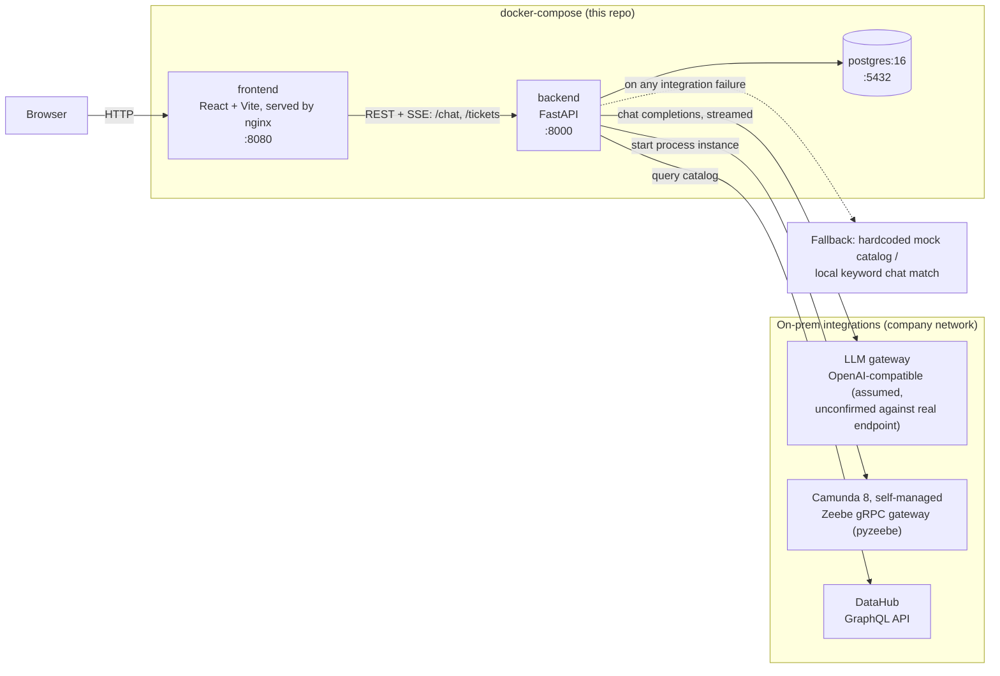
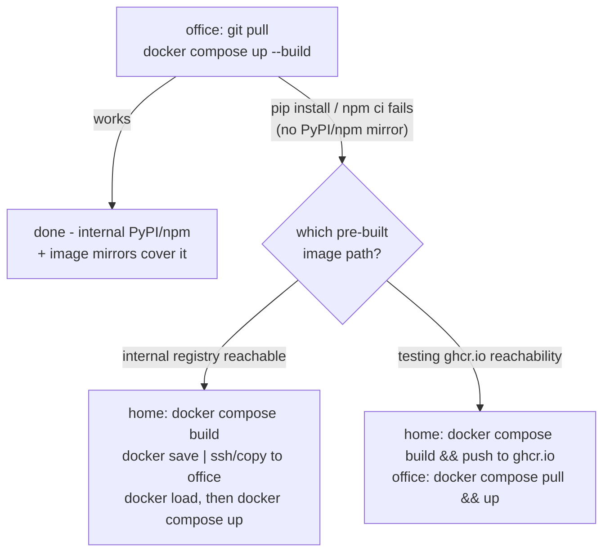

# Intelligent Data Governance — On-Prem

On-prem build of the data governance agent, for the company's air-gapped
internal network. See **`HANDOFF.md` first** — it explains why this is a
separate repo from the GCP PoC, what's swapped (Gemini → on-prem LLM,
Firestore → PostgreSQL, Dataplex → DataHub, Camunda SaaS → self-managed
Camunda), and what business logic / UI direction to carry over.

## Status: full PoC UI ported, verified end-to-end

- Backend (FastAPI + PostgreSQL) tested end-to-end against a real
  Postgres: catalog fetch, SSE chat streaming (greeting fast-path,
  zero-hallucination guard, local-keyword fallback when the LLM endpoint
  isn't reachable instead of just erroring out), ticket create/list, and
  the full approve/reject state machine (including SLA cycle-time
  tracking).
- Frontend (React + Vite) is a full port of the GCP PoC's UI: Discover
  search with live SSE streaming (reasoning steps + answer text appear
  as they happen, not after one big wait), Approvals list with SLA
  highlighting, cart + submit dialog, connection-code dialog, Copilot
  dock, zh/en toggle, light/dark toggle (light by default regardless of
  OS preference), collapsible nav rail. Verified via a full Playwright
  run through every flow against the real backend — zero console errors.
- Camunda (`pyzeebe`) and DataHub (GraphQL) integrations are **real,
  wired clients** now, not mocks — verified to correctly attempt a
  connection and fail gracefully when nothing's listening yet. Still
  need: a deployed BPMN process (`CAMUNDA_PROCESS_ID` is a placeholder),
  and validation of the DataHub field-mapping assumptions once there's a
  real instance to test against. See HANDOFF.md "What's actually in this
  repo right now" for the full list of what's confirmed vs. assumed.
- LLM integration assumes an OpenAI-compatible endpoint — **unconfirmed**
  against the real on-prem gateway, see `backend/app/integrations/llm_client.py`.

## Architecture



Ticket/approval state machine and chat contract are documented in
`HANDOFF.md` ("Business logic and data model to preserve") — this
diagram is just the component/network shape, not the business logic.

### Getting an image onto the air-gapped network

The open question is *how the backend/frontend images get built* when
the company network can reach GitHub but not PyPI/npm/Docker Hub
directly (see `HANDOFF.md` "Why this repo exists" for the full
constraint). Try these **in order** — each one only matters if the
previous one fails:



**Step 1 — just try it at the office first, before anything else:**
```bash
git pull
docker compose up --build
```
This single command tests three things at once: whether the Docker
daemon's registry mirror covers the base images (`python:3.11-slim`,
`node:20-alpine`, `nginx:alpine`, `postgres:16-alpine` — many corporate
Docker setups configure a transparent `registry-mirrors` entry in
`daemon.json` for this, no Dockerfile change needed), whether `pip
install` reaches an internal PyPI mirror, and whether `npm ci` reaches
an internal npm mirror. If this works, nothing else in this section is
needed.

**Step 2 — if `pip`/`npm` can't reach a mirror,** the image has to be
built somewhere with internet access (i.e. at home) and gotten onto the
company network some other way. Two options, both untested so far:

- **Internal Docker registry** (the confirmed-to-exist one): build at
  home, push there directly if reachable from home, or `docker save`
  the image to a tarball and carry/copy it over if not, then `docker
  load` on the office side.
- **GHCR test path** (`ghcr.io`, since plain `github.com` is reachable
  from the office): `docker-compose.yml`'s `backend`/`frontend` services
  set `image:` to `ghcr.io/mail2yee/intelligent-data-governance-agent-onprem-{backend,frontend}:latest`
  alongside `build:`, so `docker compose build` tags for this and
  `docker compose push` publishes it (after `docker login ghcr.io -u
  mail2yee` with a PAT that has `write:packages`). The packages are
  being kept **public** during this test phase specifically so the
  office side needs no login/PAT — just `git pull && docker compose
  pull && docker compose up`. **Whether `ghcr.io` itself (a different
  host than `github.com`) is actually reachable from the office is
  unconfirmed — that's what this path is testing.** Revisit and switch
  the packages back to private once confirmed working.

Either way, capture what happens at the office with
`./scripts/collect-debug-log.sh` (or manually in `TESTING_LOG.md`) and
push it — see that file for details. It checks reachability to
`github.com`/`ghcr.io`/Docker Hub/PyPI/npm in one shot, which tells you
which of the steps above is worth trying.

## Code map

Where things live and what each piece is for — HANDOFF.md has the *why*
(business rules, UI direction, what's confirmed vs. assumed), this is
just the *where*.

**Backend** (`backend/app/`):
- `main.py` — FastAPI app, every HTTP route: `/health`, `/api/catalog`,
  `/api/catalog/{id}/connection`, `/api/chat` (SSE), `/api/tickets`
  (create/list), `/api/tickets/{id}/approvals` (approve/reject). Owns the
  ticket/approval state machine — status derivation and cycle-time
  calculation live right in the route handlers, no separate service
  layer.
- `chat.py` — the chat/search assistant: greeting fast-path
  (`is_greeting`), the zero-hallucination prompt (`build_prompt`), the
  local keyword fallback (`local_rule_match`) used only when the LLM is
  unreachable, and `run_chat()`, the async generator that yields the SSE
  `step` / `token` / `final` events.
- `config.py` — one `pydantic-settings` field per `.env` variable (LLM /
  Camunda / DataHub endpoints, CORS origins, fallback approvers). Any new
  env-tunable value belongs here, not scattered as a literal elsewhere.
- `db.py` — SQLAlchemy async models (`Ticket`, `Approval`) plus the
  engine/session factory. Schema is created on startup via `init_db()` —
  no migrations tool yet, fine for this stage.
- `integrations/llm_client.py` — calls the on-prem LLM gateway, assumed
  OpenAI-compatible (`POST {LLM_BASE_URL}/chat/completions`,
  `stream: true`) — **unconfirmed** against the real endpoint.
- `integrations/camunda_client.py` — `pyzeebe` client, starts a BPMN
  process instance per new ticket; returns a "Skipped" status gracefully
  if the gateway/process isn't reachable/deployed yet.
- `integrations/datahub_client.py` — queries DataHub's GraphQL API for
  the product catalog (mapping `customProperties` to the fields the
  frontend expects); falls back to a hardcoded 3-item mock catalog if
  DataHub is unreachable or empty.
- `tests/` — the pytest suite (36 tests), one file per module above.

**Frontend** (`frontend/src/`):
- `App.jsx` — top-level state (lang, theme, current view, cart, tickets)
  and wiring between the two views and the dialogs/dock. No router —
  `view` (`'discover'` / `'approvals'`) is just local state.
- `api.js` — every backend call lives here, including `streamChat()`,
  which parses the `/api/chat` SSE stream by hand (buffers partial
  frames, splits on blank lines) rather than using an SSE library.
- `i18n.js` — `makeT(lang)` returns a `t(key)` translator; a test checks
  zh/en key parity so the two languages can't silently drift apart.
- `components/DiscoverView.jsx` — search hero, result cards, the live
  "reasoning steps" disclosure.
- `components/ApprovalsView.jsx` + `TicketRow.jsx` — expandable ticket
  rows, approve/reject actions, the SLA warning banner.
- `components/CopilotDock.jsx` — the docked "小幫手" assistant panel,
  drives `streamChat()`.
- `components/NavRail.jsx`, `TopBar.jsx` — chrome: collapsible nav
  groups, lang/theme toggles.
- `components/CartBar.jsx`, `SubmitDialog.jsx`,
  `ConnectionCodeDialog.jsx`, `Toast.jsx`, `ThinkingDots.jsx` —
  supporting UI pieces, one component per file.
- `*.test.jsx` / `*.test.js` — vitest + React Testing Library (29 tests).

## Run it locally (dev, at home)

```bash
docker compose up --build
```

- Frontend: http://localhost:8080
- Backend: http://localhost:8000 (docs at `/docs`)
- Postgres: localhost:5432 (user/pass/db: `dgo`/`dgo`/`dgo`)

Or run backend/frontend separately without Docker — see
`backend/README.md` and `frontend/README.md`.

## Repo layout

```
backend/                    FastAPI API (Python) — see backend/README.md
frontend/                   React + Vite SPA — see frontend/README.md
k8s/                        placeholder for future Kubernetes manifests (not needed yet — Docker is fine for now)
scripts/collect-debug-log.sh  one-command diagnostics collector, see TESTING_LOG.md
debug-logs/                 output of the script above, committed for review from home
docker-compose.yml          local/on-prem multi-container dev setup
TESTING_LOG.md               office <-> home handoff log (no Claude Code on-site)
HANDOFF.md                  why this repo exists, what to port from the GCP PoC, current constraints
```
