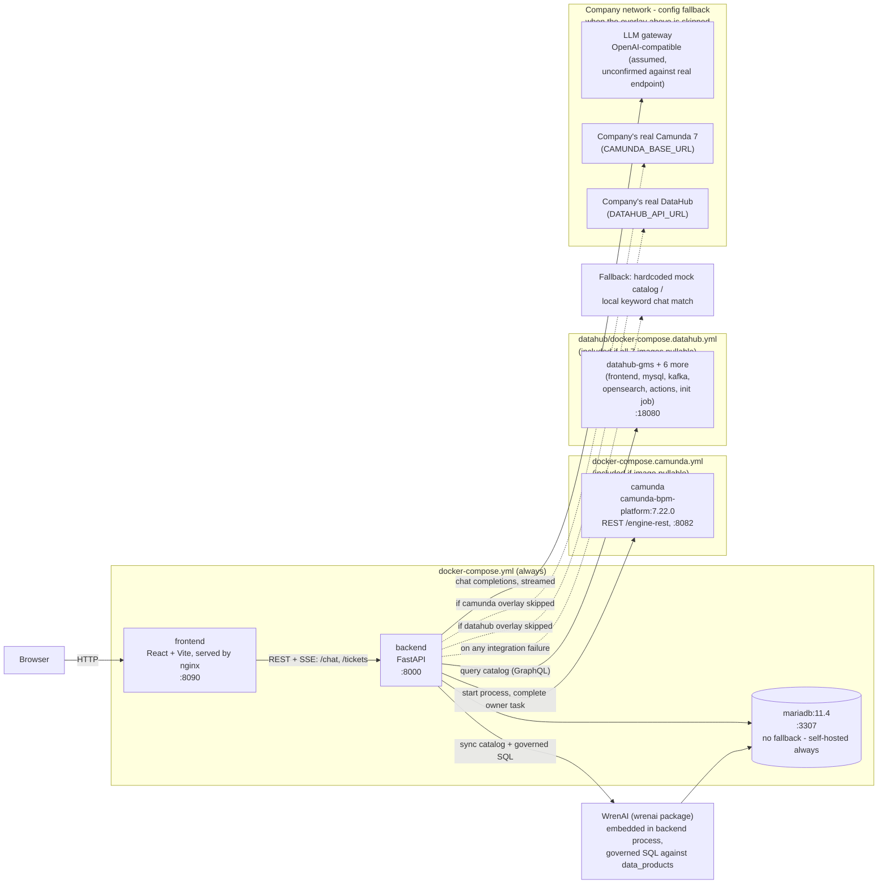
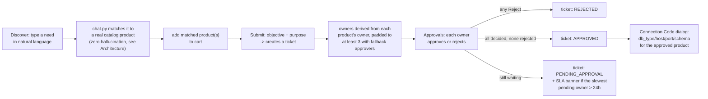
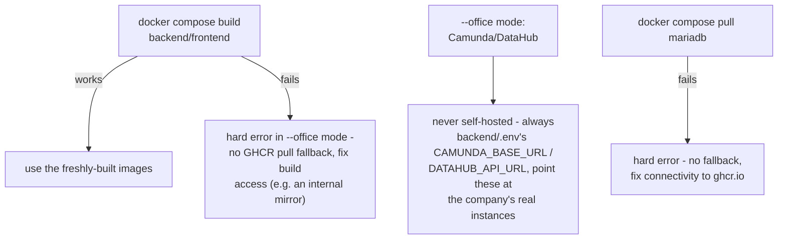

# Intelligent Data Governance — On-Prem

On-prem build of the data governance agent, for the company's air-gapped
internal network. See **`HANDOFF.md` first** — it explains why this is a
separate repo from the GCP PoC, what's swapped (Gemini → on-prem LLM,
Firestore → MariaDB, Dataplex → DataHub, Camunda SaaS → self-managed
Camunda), and what business logic / UI direction to carry over.

## 中文說明

這份 README 主要用英文寫，這一節是給不想切語言、想快速掌握全貌的中文摘要——細節（架構圖、逐檔案的 code map、部署步驟）都在下面對應的英文章節，這裡不重複貼一次圖，只講重點。

**這是什麼：** GCP PoC（`data_governance_agent_poc.ai`，另一個 repo）的 on-prem 重建版，因為公司內網是氣隔離（air-gapped）——連得到 GitHub，但連不到 PyPI/npm/Docker Hub——原本 PoC 用的 Gemini/Firestore/Dataplex/Camunda SaaS 全部要換成內網可用的服務。兩個 repo **故意不共用程式碼**，重用的是行為/設計，不是檔案。細節在 `HANDOFF.md`。

**技術堆疊：** 後端 FastAPI + MariaDB，前端 React + Vite，Camunda（REST API）跟 DataHub（GraphQL）都是真的串接（不是 mock），串不上時會 graceful fallback（例如查目錄失敗就退回內建的假目錄，LLM 打不通就退回本地關鍵字比對）。另外還內嵌了 WrenAI（`wrenai` pip 套件，**不是**另外一個 service）當語意層——LLM 對照語意模型欄位名組 SQL，WrenAI 的 governed engine 執行並擋掉任何沒宣告過的欄位/資料表，用來取代原本「靠 prompt 指令+事後字串比對」的推薦機制，讓「這句話該推薦哪個資料主體」這件事變成結構性零幻想，而不是只靠 LLM 自己乖。

**重要修正（2026-07-29）：Camunda 公司實際用的是 7.22 版**，不是原本以為的 Camunda 8（Zeebe/gRPC）——是完全不同的產品（REST API，沒有 gRPC/job worker 模型）。`camunda_client.py` 已經整個重寫並拿真實的本機 `camunda/camunda-bpm-platform:7.22.0` container 實測驗證過。

**目前狀態：** 前端已經把 PoC 的 UI 完整 port 過來並跑過完整 Playwright 端到端測試，視覺風格已改成對齊公司 TADiS 設計系統；後端 **88** 個 pytest、前端 29 個 vitest 全過；`ruff`/`mypy`/`oxlint` 全乾淨。LLM 目前預設用本機 Ollama 的 **qwen3:14b**（`backend/.env`），OpenAI-compatible 假設已實測驗證可行，但**公司內部真實的 LLM gateway 還沒接過**——這是到公司要做的事。另外還做了一套 DeepEval eval 套件（`backend/evals/`）可以量化評分聊天比對的表現，目前只拿本機 Ollama 測過。**安全性：** 所有 `/api/*` route 現在支援 `X-API-Key` 驗證（預設關閉，設定 `API_KEY` 就會啟用）；前端曾經有 3 處真的 XSS 漏洞（把 LLM/使用者輸入直接當 HTML 渲染）已修掉——細節見 HANDOFF.md「Security review」。**搜尋：** Discover 頁多了「一般搜尋／AI 搜尋」切換（預設一般搜尋，純關鍵字比對不用 LLM）。

**2026-08-05 架構調整：Camunda、DataHub、Postgres 現在都是「預設自架 image，image 抓不到就退回 config 裡設定的公司真實服務」**（Postgres 除外，一律自架，沒有退回機制）。DataHub 從原本跟 sibling repo 共用的獨立 `datahub docker quickstart` stack，改成直接併進這個 repo 自己的 `docker-compose.yml`（`datahub/docker-compose.datahub.yml`，7 個 container：GMS、前端、MySQL、Kafka、OpenSearch、Actions、一次性 init job）。新增 **`./deploy.sh`** 作為一鍵部署入口——會依序嘗試 pull 每個 image，抓得到就自架、抓不到就跳過並讓 app 退回用 `backend/.env` 裡已經設定的公司端點。全部 9 個 image（backend、frontend、camunda、mariadb、加上 DataHub 的 7 個）都走 `ghcr.io/mail2yee/...`，公司防火牆已確認連得到。細節見 `HANDOFF.md`「Self-hosted images with a config fallback」。

**2026-08-26 再調整：Camunda/DataHub 的「image 路線」放棄了。** 帶去公司實測後，這些 image 全部被公司的漏洞掃描擋下來，換了幾輪更高/更新的版本（`mysql`→8.4.9、`opensearch`→2.19.6、`cp-kafka`→8.3.0，全部實測過相容性）也只能把數字壓低，壓不到零——Camunda 本身沒有更新版本可換，卡在 5 critical/32 high。與其繼續跟 CVE 數字纏鬥，公司端現在**直接不自架 Camunda/DataHub，一律用 config 接公司自己已經核准的服務**；backend/frontend 也一併不再從 `ghcr.io` pull，公司端只用 `git pull` + 現場 `docker build`。本機 dev 環境不受影響，一樣自架整套方便測試。用法：`./deploy.sh --office`。細節見 `HANDOFF.md`「Office mode」。

**2026-08-27：資料庫從 Postgres 換成 MariaDB。** 跟漏洞掃描無關（MariaDB 掃出來的數字其實還比 Postgres 差一點），純粹是想要自己完全掌控這顆資料庫，不想接公司那套肥 HA Postgres。`backend/app/db.py`（MySQL/MariaDB 的 VARCHAR 一定要指定長度，跟 Postgres 不一樣，已經全部補上）、WrenAI 的 `connection_profile.json`（`datasource` 改 `mysql`，MariaDB 走 MySQL 協定相容）都已經改完並實測過（真的建表、真的建立票單、真的讓 WrenAI 執行 SQL 查詢）。細節見 `HANDOFF.md`「DB engine switched to MariaDB」。

**2026-08-30：新增 GKE demo 部署，跟公司內網無關，純粹是「給特定人看」用途。** 完整架構搬到 `k8s/` 目錄（`docker-compose.yml`/overlay 的手寫 K8s 版本，StatefulSet+PVC 處理所有有狀態服務），真的部署上一個 GKE cluster，用 Google Identity-Aware Proxy（IAP）限制只有指定的 Google 帳號能連得進去，HTTPS 走 Google-managed 憑證。過程中發現 GKE 舊版 Ingress 控制器整個罷工（連一次同步都沒有，兩個不同 cluster 都一樣，Google 管控平面內部元件、指令行完全查不到原因），改用 Gateway API（Google 現在主推的新架構）才真正跑起來。細節、實際部署步驟、踩過的坑全部寫在 `k8s/README.md`。

**架構：** `docker-compose.yml` + 兩個可選的 overlay 檔案（`docker-compose.camunda.yml`、`datahub/docker-compose.datahub.yml`）——`frontend`（nginx 提供 React 靜態檔，:8090）呼叫 `backend`（FastAPI，:8000）的 REST/SSE API，`backend` 讀寫 `mariadb`（:3307，本機自架，無退回機制），也打 `camunda`（本機自架 REST API，:8082，抓不到 image 就退回 config）、DataHub（本機自架 GMS，:18080，同樣抓不到就退回 config），對外打一個內網服務：LLM gateway。完整圖見下面「Architecture」章節。

**程式碼在哪裡：** 後端邏輯全在 `backend/app/`——`main.py` 是所有 HTTP 路由、票單/簽核狀態機、`X-API-Key` 驗證，`chat.py` 是聊天助理（打招呼快速回覆、zero-hallucination 提示詞、LLM 打不通時的本地關鍵字 fallback、`keyword_search()` 一般搜尋模式），`config.py` 集中管理所有環境變數，`db.py` 是資料庫 model，`integrations/` 底下三個檔案分別對應 LLM/Camunda/DataHub 三個外部串接。前端在 `frontend/src/`——`App.jsx` 管全域狀態，`api.js` 是所有後端呼叫（含手刻的 SSE 串流解析），`i18n.js` 管中英文字串，`components/` 底下一個檔案一個 UI 元件。完整逐檔案說明見下面「Code map」章節。

**怎麼跑起來 / 公司內網部署策略：** 第一次跑之前要先 `cp backend/.env.example backend/.env`（**必須**，`docker-compose.yml` 會直接讀這個檔案，不存在的話連啟動都會失敗；`./deploy.sh` 會自動幫你做這步）。在家用 `./deploy.sh`（不加參數）——backend/frontend 從本機原始碼 build，Camunda/DataHub 各自嘗試 pull image，抓得到就自架、抓不到才退回 `backend/.env` 裡的端點。**到公司用 `./deploy.sh --office`**——這個模式下 Camunda/DataHub 完全不會嘗試自架（連 pull 都不會做），一律直接用 `backend/.env` 裡設定的公司端點；backend/frontend 也只從原始碼 build，不會退回去 `ghcr.io` pull（本來就是要避開被公司掃描器擋下來的 image）。MariaDB 兩種模式都一樣，永遠自架、沒有退回機制。完整決策流程、以及怎麼把測試結果（log）帶回家給我看，見下面「Getting an image onto the air-gapped network」跟 `TESTING_LOG.md`。

## 到公司後怎麼做（照順序，一步一步）

這節是給你到公司當場照著做的清單，不用跳來跳去查其他章節。每一步都寫了「怎麼知道這步成功了」。

**Step 0 — 拿程式碼**

兩種方式，差在「之後能不能自動同步」：

- **`git clone`（推薦）**：需要先建一個 GitHub PAT（Settings → Developer settings → Personal access tokens → Tokens (classic)，勾 `repo` 權限就好，read 即可）。這樣才能之後 `git pull` 拿更新，也才能用 `scripts/collect-debug-log.sh` 自動把診斷結果 commit + push 回來給我看。
  ```bash
  git clone https://github.com/mail2yee/intelligent-data-governance-agent-onprem.git
  cd intelligent-data-governance-agent-onprem
  ```
- **GitHub 網頁「Download ZIP」解壓縮**：不用設定 git 帳密，簡單，但拿到的資料夾沒有 `.git`——之後沒辦法 `git pull`、也沒辦法自動 push 診斷結果，要手動複製貼上回來給我。

**Step 1 — 一鍵部署（公司內網一定要加 `--office`）**
```bash
./deploy.sh --office
```
`--office` 模式（2026-08-26 起）：Camunda/DataHub **完全不會嘗試自架**（連 pull 都不會做），一律直接用 `backend/.env` 裡設定的端點——所以 Step 3 之前記得先確認 `backend/.env` 的 `CAMUNDA_BASE_URL`/`DATAHUB_API_URL` 已經指到公司真實的服務，不然會一直是 graceful fallback（Camunda 顯示 "Skipped"、DataHub 退回內建假目錄）。backend/frontend 只從本機原始碼 build，不會退回去 `ghcr.io` pull（這就是重點：不再依賴任何會被公司掃描器擋下來的 image）。MariaDB 不受 `--office` 影響，兩種模式都一樣自架、沒有退回機制，抓不到會直接報錯。跑完會印出每個服務最後是「自架」還是「退回 config」。

如果 `./deploy.sh --office` 整個失敗（連 MariaDB 都抓不到，或 backend/frontend build 失敗），先不要繼續往下試，跳到最下面「有問題怎麼辦」那段，把診斷結果帶回來，我們再一起想下一步。

**Step 2 — 確認真的跑起來了**
```bash
curl http://localhost:8000/health   # 應該回傳 {"status":"ok"}
```
瀏覽器打開 http://localhost:8090 應該看到「智慧資料治理平台」畫面，可以試著搜尋一句話看看（現在還沒接公司 LLM，會走 fallback，屬於正常現象）。

**Step 3 — 接上公司真實的 LLM（如果你已經知道公司內部 gateway 的網址/model 名稱）**

編輯 `backend/.env`，把這三行改成公司真實的值：
```bash
LLM_BASE_URL=<公司內部 LLM gateway 網址>/v1
LLM_MODEL=<公司內部的 model 名稱>
LLM_API_KEY=<如果 gateway 需要驗證的話，不需要就留空>
```
改完套用（不用重新 build，只要讓 container 重新讀取 `.env`）：
```bash
docker compose up -d --force-recreate backend
```
再回 Step 2 測一次搜尋，這次應該會真的呼叫公司的 LLM，不再是 fallback（可以從瀏覽器的「顯示思考過程」或 `docker compose logs backend` 觀察差異）。

**Step 4（選用）— 跑 eval，看公司 model 表現怎麼樣**
```bash
pip install -r backend/requirements-eval.txt
DGO_EVAL_JUDGE_MODEL=<公司 model 名稱> \
DGO_EVAL_JUDGE_BASE_URL=<公司 gateway 網址>/v1 \
DGO_EVAL_JUDGE_API_KEY=<如果需要> \
pytest backend/evals/ -v -s
```
結果值得記錄的話，寫進 `backend/evals/EVAL_LOG.md`（跟本機用 Ollama 測出來的 0.50-1.00 分數對照，看真實的公司 model 表現如何）。細節見 `backend/README.md`「Evals」那節。

**有問題怎麼辦：**
```bash
./scripts/collect-debug-log.sh
```
自動收集 git 狀態、docker/compose 版本、對 `github.com`/`ghcr.io`/Docker Hub/PyPI/npm 的連線測試、`docker compose config`/`pull`/`ps`/`logs`，做基本的密碼/token 遮蔽後印出來給你看，確認沒問題再問你要不要 commit + push（只有 Step 0 用 `git clone` 才能這樣自動回傳；用 ZIP 的話這個檔案還是會產生，只是最後要手動複製貼上內容給我，不是自動 push）。

## Status: full PoC UI ported, verified end-to-end

- Backend (FastAPI + MariaDB, switched from Postgres 2026-08-27 - see
  HANDOFF.md) tested end-to-end against a real database: catalog fetch,
  SSE chat streaming (greeting fast-path,
  zero-hallucination guard, local-keyword fallback when the LLM endpoint
  isn't reachable instead of just erroring out), ticket create/list, and
  the full approve/reject state machine (including SLA cycle-time
  tracking).
- Frontend (React + Vite) is a full port of the GCP PoC's UI: Discover
  search with live SSE streaming (reasoning steps + answer text appear
  as they happen, not after one big wait), Approvals list with SLA
  highlighting, cart + submit dialog, connection-code dialog, Copilot
  dock, zh/en toggle, light/dark toggle (light by default regardless of
  OS preference), collapsible nav rail. Verified via a full Playwright
  run through every flow against the real backend — zero console errors.
- **Camunda 7.22 (REST API — corrected 2026-07-29 from an earlier, wrong
  Camunda 8/Zeebe assumption) and DataHub (GraphQL) integrations are
  real, wired clients**, and both are **self-hosted by default** as part
  of this repo's own `docker-compose.yml` (via `docker-compose.camunda.yml`
  and `datahub/docker-compose.datahub.yml` - DataHub is 7 containers:
  GMS, frontend, MySQL, Kafka, OpenSearch, Actions, a one-shot init job).
  The complete loop — create a ticket -> Camunda starts a process
  instance -> an owner approves in-app -> that owner's Camunda task
  completes -> ticket reaches APPROVED and the Camunda process instance
  ends — is verified end-to-end through the actual running app, not just
  curl against a standalone container. See HANDOFF.md "Self-hosted
  images with a config fallback" for the full writeup, including gaps
  still explicitly deferred (approval-endpoint auth, email
  notifications, ticket deep-linking).
- **`./deploy.sh` has two modes** (2026-08-05, revised 2026-08-26): no
  flag = local dev, tries to pull each of Camunda/DataHub's images,
  self-hosts what it can pull, falls back to `backend/.env`'s
  `CAMUNDA_BASE_URL`/`DATAHUB_API_URL` for whatever it can't.
  **`--office`** = Camunda/DataHub are never self-hosted at all (no
  pull attempted, full stop) - always the company's real endpoint via
  config; backend/frontend build from source only, no GHCR pull
  fallback either. Adopted after the office's vulnerability scanner
  blocked the mirrored Camunda/DataHub images and further version bumps
  couldn't get the CVE count to zero (see HANDOFF.md's "Vulnerability
  remediation round" and "Office mode" sections). MariaDB has no
  fallback in either mode - self-hosting it is the actual plan, a
  failed pull is a hard error. See "Getting an image onto the
  air-gapped network" below.
- LLM integration assumes an OpenAI-compatible endpoint — **confirmed
  working against a real local Ollama** (currently `qwen3:14b`, see
  `backend/.env`), but still **unconfirmed against the company's actual
  on-prem gateway** (a different, untested endpoint), see
  `backend/app/integrations/llm_client.py`.
- WrenAI, embedded as a Python library (not a separate service - see
  HANDOFF.md), enforces zero-hallucination product matching for
  `chat.py`; a DeepEval-based eval suite (`backend/evals/`) can score
  reply quality/precision against any OpenAI-compatible judge model,
  local or the company's real gateway — see "Evals" in
  `backend/README.md`.
- **Security review (2026-07-30)**: found and fixed zero authentication
  on the API (every `/api/*` route now supports `X-API-Key`, off by
  default) and 3 real frontend XSS sites (`dangerouslySetInnerHTML` on
  LLM/user-controlled text, now plain text). Interim measures, not a
  full fix — see HANDOFF.md "Security review" for what's still open
  (notably `submit_approval()`'s owner-impersonation gap, which needs
  real SSO/OIDC).
- **Discover search has a general/AI mode toggle** (2026-07-31, defaults
  to general/keyword search — plain `ILIKE` match against the catalog,
  no LLM call). Greeting detection (`is_greeting()`) is keyword-only —
  an LLM-based fallback was tried and reverted after live testing showed
  it unreliable on a small local model; unmatched queries are logged
  instead for offline, human-reviewed triage
  (`backend/scripts/review_unmatched_queries.py`) — see HANDOFF.md.
- **All 9 images mirror from GHCR** (`backend`, `frontend`, `camunda`,
  `mariadb`, and DataHub's 7) — confirmed the office network can reach
  `ghcr.io` even though it can't reach Docker Hub or the company's own
  Harbor/Nexus (neither has a Camunda image). See "Getting an image onto
  the air-gapped network" below.
- **A separate GKE demo deployment exists** (2026-08-30, `k8s/`) —
  unrelated to the office/air-gapped target above, this is a
  hand-written K8s port of the same docker-compose stack, deployed for
  real to a live GKE cluster and restricted via Identity-Aware Proxy to
  a specific Google account. Real GKE-only bugs (non-root containers vs.
  real Persistent Disk permissions, a stale GHCR image, and — the big
  one — the classic Ingress-GCE controller never working at all on two
  separate clusters, fixed by switching to Gateway API) are documented
  in `k8s/README.md`, not repeated here.

## Architecture



Ticket/approval state machine and chat contract are documented in
`HANDOFF.md` ("Business logic and data model to preserve") — this
diagram is just the component/network shape, not the business logic.

## Product flow

What a user actually does, end to end - full business rules (owner
padding, SLA threshold, exact status-derivation logic) are in
`HANDOFF.md` "Business logic and data model to preserve"; this is the
shape of the flow, not every rule.



- **Discover** (`DiscoverView.jsx` / `chat.py`): a natural-language need
  gets matched to catalog product(s) via the semantic layer, streamed
  live as `step`/`token` SSE events, cards render once a `final` event
  arrives with the verified `matched_products`.
- **Cart → Submit** (`CartBar.jsx`, `SubmitDialog.jsx` /
  `POST /api/tickets`): selected products + an objective/purpose become
  a ticket. Owners are the union of each product's real owner, padded to
  a minimum of 3 with `DEFAULT_FALLBACK_APPROVERS` if short - this
  padding rule is arbitrary PoC filler, ported as-is, worth reconsidering
  once real approval requirements are known (see HANDOFF.md). Camunda is
  notified best-effort (`camunda_client.py`) - a "Skipped" status if
  unreachable doesn't block ticket creation; if it succeeds, the returned
  `process_instance_id` is persisted on the ticket for later use.
- **Approvals** (`ApprovalsView.jsx`/`TicketRow.jsx` /
  `POST /api/tickets/{id}/approvals`): each owner approves or rejects
  independently; ticket status is derived, not stored as an independent
  field - `REJECTED` wins if any owner rejects, `APPROVED` only once
  every owner has decided and none rejected, otherwise
  `PENDING_APPROVAL`. The SLA banner looks at whichever pending owner has
  waited longest since their approval record was created; past 24h it
  surfaces a warning on that ticket's expanded row. Also completes that
  owner's task in Camunda (best-effort, via the persisted
  `process_instance_id`) - verified end-to-end that the process instance
  itself ends once every owner's task is completed this way.
- **Connection Code** (`ConnectionCodeDialog.jsx` /
  `GET /api/catalog/{id}/connection`): once approved, this is as far as
  the app goes - it hands back the target database's connection details
  (`db_type`/`db_host`/`db_port`/`db_schema`) for the user to connect
  with their own tools. The app never queries the real underlying
  business data itself (see HANDOFF.md's semantic-layer scope notes).

### Getting the app running at the office (2026-08-26: image path abandoned for Camunda/DataHub)

`./deploy.sh --office` automates the decision below - this section is
what it's actually doing under the hood, useful if it fails somewhere
and you need to debug a specific step. **This replaces the earlier
"pull everything from ghcr.io, including Camunda/DataHub" plan** -
those images got taken to the office, flagged by the company's
vulnerability scanner, and even after chasing newer patch versions the
CVE count couldn't be gotten to zero (Camunda alone has no newer patch
available at all - see HANDOFF.md's "Vulnerability remediation round"
and "Office mode" sections for the full history and numbers). Rather
than keep fighting that, Camunda/DataHub simply aren't self-hosted at
the office anymore.



**Backend/frontend**: `--office` mode builds from local source only
(`docker compose build`, testing whether the Docker daemon's registry
mirror covers the base images `python:3.11-slim`/`node:20-alpine`/
`nginx:alpine`, and whether `pip install`/`npm ci` reach internal
mirrors) - a failed build is a hard error, not a silent fallback to a
`ghcr.io`-published image. That's deliberate: this repo's own
backend/frontend images were never actually scanned during the
vulnerability-remediation round, but there's no reason to assume the
office's scanner would treat them differently, so the office no longer
depends on any GHCR-hosted image for its own code either. (Local dev,
no `--office` flag, still falls back to a GHCR pull if the local build
fails - that path is unaffected.)

**Camunda/DataHub**: in `--office` mode, `deploy.sh` never runs
`docker compose pull` for these and never includes their overlay files
(`docker-compose.camunda.yml` / `datahub/docker-compose.datahub.yml`) -
the app always uses whatever `CAMUNDA_BASE_URL`/`DATAHUB_API_URL` are
set to in `backend/.env`. Point those at the company's real instances
before running `--office`, or ticket creation will just report a
graceful "Skipped" Camunda status and DataHub will fall back to the
app's built-in mock catalog. (Local dev, no `--office` flag, still
tries to self-host both via image first - useful for testing the agent
without company network access.)

**MariaDB**: no fallback in either mode - `deploy.sh` treats a failed
pull as a hard error, since self-hosting it is the actual plan
here (the company's own Postgres is an unwieldy HA setup, not something
worth connecting to instead - see HANDOFF.md), not something to
gracefully degrade out of.

- **GHCR path (`ghcr.io`)** is still how `mariadb`, `backend`, and
  `frontend` images get to the office (`ghcr.io/mail2yee/mariadb:11.4`,
  and `backend`/`frontend` at home via `docker compose build` + `push`,
  though `--office` itself never pulls the latter two - only local dev
  does, as a fallback). `camunda` and DataHub's 7 images are also still
  mirrored to `ghcr.io/mail2yee/...` for local dev's use, just no longer
  relevant to what happens at the office. All images are **public** —
  confirmed by pulling anonymously (no `docker login`) successfully.
  **`ghcr.io` reachability from the office is confirmed** (2026-08-04 -
  it's a different host than `github.com`, which was already known to
  work).
- **Internal registries (Harbor, Nexus)**: confirmed 2026-08-04 these
  exist but don't mirror everything - no Camunda image there, for one
  (now moot for Camunda specifically, since it's config-only at the
  office, but still worth checking for anything else).

Either way, capture what happens at the office with
`./scripts/collect-debug-log.sh` (or manually in `TESTING_LOG.md`) and
push it — see that file for details. It checks reachability to
`github.com`/`ghcr.io`/Docker Hub/PyPI/npm in one shot, which tells you
which of the steps above is worth trying.

## Code map

Where things live and what each piece is for — HANDOFF.md has the *why*
(business rules, UI direction, what's confirmed vs. assumed), this is
just the *where*.

**Backend** (`backend/app/`):
- `main.py` — FastAPI app, every HTTP route: `/health` (unauthenticated),
  `/api/catalog`, `/api/catalog/{id}/connection`, `/api/chat` (SSE),
  `/api/tickets` (create/list), `/api/tickets/{id}/approvals`
  (approve/reject) — all `/api/*` routes require `X-API-Key` when
  `API_KEY` is set (`require_api_key`). Owns the ticket/approval state
  machine — status derivation and cycle-time calculation live right in
  the route handlers, no separate service layer.
- `chat.py` — the chat/search assistant: greeting fast-path
  (`is_greeting`), the zero-hallucination prompt (`build_prompt`), the
  local keyword fallback (`local_rule_match`) used only when the LLM is
  unreachable, `keyword_search()` (the default "general search" mode -
  plain multi-keyword AND `ILIKE` against `data_products.search_text`,
  no LLM involved - see HANDOFF.md), and `run_chat(..., mode="ai" |
  "keyword")`, the async generator that yields the SSE `step` / `token`
  / `final` events.
- `config.py` — one `pydantic-settings` field per `.env` variable (LLM /
  Camunda / DataHub endpoints, CORS origins, fallback approvers). Any new
  env-tunable value belongs here, not scattered as a literal elsewhere.
- `db.py` — SQLAlchemy async models (`Ticket`, `Approval`) plus the
  engine/session factory. Schema is created on startup via `init_db()` —
  no migrations tool yet, fine for this stage.
- `integrations/llm_client.py` — calls the on-prem LLM gateway, assumed
  OpenAI-compatible (`POST {LLM_BASE_URL}/chat/completions`,
  `stream: true`) — **unconfirmed** against the real endpoint.
- `integrations/camunda_client.py` — Camunda 7 REST client
  (`/engine-rest`): starts a BPMN process instance per new ticket
  (`start_approval_process`) and completes an individual owner's task on
  approval (`complete_approval_task`); both return a "Skipped" status
  gracefully if Camunda isn't reachable, never raise. See
  `camunda/data-gov-approval.bpmn` for the deployed process (a
  multi-instance user task, one per owner).
- `integrations/datahub_client.py` — queries DataHub's GraphQL API for
  the product catalog (mapping `customProperties` to the fields the
  frontend expects); falls back to a hardcoded 3-item mock catalog if
  DataHub is unreachable or empty. See `datahub/seed_catalog.py` /
  `scripts/setup-datahub.sh` for seeding a local instance with sample
  data matching this shape.
- `integrations/wrenai_client.py` — WrenAI semantic layer, embedded as a
  Python library (not a service, see HANDOFF.md for why that matters).
  Mirrors the DataHub catalog into a `data_products` table
  (`sync_catalog()`) and executes agent-written SQL against it through a
  governed engine (`resolve_matches()`) that structurally can't return a
  row outside the declared semantic model (`../wren/project/`) - this is
  what `chat.py`'s `resolve_via_semantic_layer()` uses for
  zero-hallucination data-subject matching.
- `tests/` — the pytest suite (88 tests), one file per module above.

**Frontend** (`frontend/src/`):
- `App.jsx` — top-level state (lang, theme, current view, cart, tickets)
  and wiring between the two views and the dialogs/dock. No router —
  `view` (`'discover'` / `'approvals'`) is just local state.
- `api.js` — every backend call lives here, including `streamChat()`,
  which parses the `/api/chat` SSE stream by hand (buffers partial
  frames, splits on blank lines) rather than using an SSE library.
- `i18n.js` — `makeT(lang)` returns a `t(key)` translator; a test checks
  zh/en key parity so the two languages can't silently drift apart.
- `components/DiscoverView.jsx` — search hero, result cards, the live
  "reasoning steps" disclosure, and the general/AI search mode toggle
  (persisted in `localStorage`, defaults to general/keyword search - see
  HANDOFF.md).
- `components/ApprovalsView.jsx` + `TicketRow.jsx` — expandable ticket
  rows, approve/reject actions, the SLA warning banner.
- `components/CopilotDock.jsx` — the docked "小幫手" assistant panel,
  drives `streamChat()`.
- `components/NavRail.jsx`, `TopBar.jsx` — chrome: collapsible nav
  groups, lang/theme toggles.
- `components/CartBar.jsx`, `SubmitDialog.jsx`,
  `ConnectionCodeDialog.jsx`, `Toast.jsx`, `ThinkingDots.jsx` —
  supporting UI pieces, one component per file.
- `*.test.jsx` / `*.test.js` — vitest + React Testing Library (29 tests).

## Run it locally (dev, at home)

(For the office/air-gapped network, use `./deploy.sh --office` instead
— see "Getting the app running at the office" below. Everything in
this section is the local-dev-only, no-flag behavior.)

**Configuration (required once, before the first run):**
```bash
cp backend/.env.example backend/.env   # required - docker-compose.yml
                                        # references this file directly; it
                                        # won't even start without it existing
cp .env.example .env                   # optional - only needed to override
                                        # the default MariaDB password
```
`backend/.env`'s defaults (mock LLM endpoint) are enough to start the app
and see it fall back gracefully — edit `LLM_BASE_URL`/`LLM_MODEL`/
`LLM_API_KEY` once the real on-prem gateway is known. See the comments in
`backend/.env.example` for what each variable does.

**Auth note:** every `/api/*` route is unauthenticated by default (`API_KEY`
blank) — fine for local dev, but set `API_KEY` in `backend/.env` **and**
matching `VITE_API_KEY` in the repo-root `.env` (rebuild the frontend image
after changing it — Vite bakes it in at build time, see
`frontend/Dockerfile`) before any real deployment. See HANDOFF.md's
"Security review" section for exactly what this does and doesn't protect
against.

```bash
./deploy.sh
```

Camunda and DataHub are both self-hosted by default (as part of this
same command) - `deploy.sh` only skips one if its image can't be pulled,
falling back to whatever `CAMUNDA_BASE_URL`/`DATAHUB_API_URL` is set to
in `backend/.env` instead (see HANDOFF.md's "Self-hosted images with a
config fallback"). MariaDB has no such fallback - self-hosting it is
the actual plan. The full ticket/approval/Camunda-task-completion loop
and a real DataHub-backed catalog both work with zero extra setup beyond
this one command. Equivalent to (and this is what `deploy.sh` actually
runs under the hood):
```bash
docker compose -f docker-compose.yml -f docker-compose.camunda.yml -f datahub/docker-compose.datahub.yml up --build -d
```

- Frontend: http://localhost:8090
- Backend: http://localhost:8000 (docs at `/docs`)
- MariaDB: localhost:3307 (user/pass/db: `dgo`/`dgo`/`dgo`)
- Camunda: http://localhost:8082/engine-rest (REST API, no UI)
- DataHub: GMS http://localhost:18080, UI http://localhost:19002
  (user/pass: `datahub`/`datahub`) - seed it with sample data via
  `scripts/setup-datahub.sh` (now points at this self-hosted instance,
  not the old shared one)

Or run backend/frontend separately without Docker — see
`backend/README.md` and `frontend/README.md` (same `backend/.env` config
step applies there too).

## Repo layout

```
backend/                    FastAPI API (Python) — see backend/README.md
frontend/                   React + Vite SPA — see frontend/README.md
wren/project/                WrenAI semantic model (MDL) - see app/integrations/wrenai_client.py
camunda/data-gov-approval.bpmn  BPMN process this app deploys to Camunda itself on startup
datahub/seed_catalog.py     seeds sample dataset entities into a local DataHub instance
scripts/setup-datahub.sh    stands up + seeds a local DataHub instance (own docker quickstart stack)
scripts/mirror-image-to-ghcr.sh  retags + pushes a public third-party image (Camunda, MariaDB) to this repo's GHCR namespace
backend/scripts/review_unmatched_queries.py  offline, human-reviewed triage of chat queries that matched nothing
k8s/                        GKE demo deployment (Gateway API + IAP) - unrelated to the office target, see k8s/README.md
scripts/collect-debug-log.sh  one-command diagnostics collector, see TESTING_LOG.md
debug-logs/                 output of the script above, committed for review from home
docker-compose.yml          local/on-prem multi-container dev setup (mariadb, camunda, backend, frontend)
TESTING_LOG.md               office <-> home handoff log (no Claude Code on-site)
HANDOFF.md                  why this repo exists, what to port from the GCP PoC, current constraints
```
